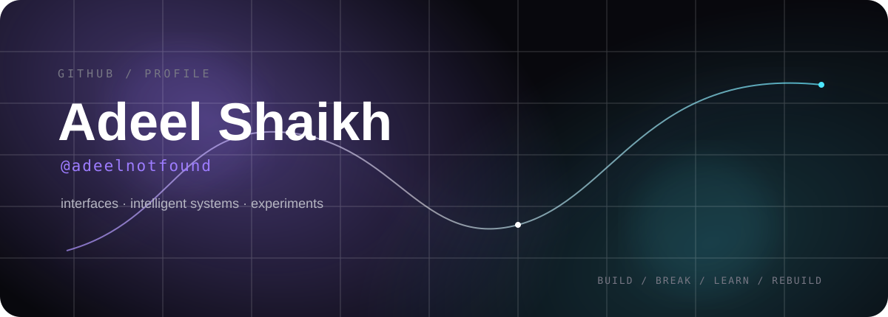

<div align="center">

<a href="https://github.com/adeelnotfound">
  
</a>

<br/>


<br/>

<a href="https://github.com/adeelnotfound?tab=repositories">
  
</a>
<a href="https://github.com/adeelnotfound">
  
</a>

<br/><br/>

> **I build interfaces, intelligent systems, and useful little experiments.**

</div>

---

## `~/adeelnotfound`

```text
┌─ identity ───────────────────────────────────────────────────────┐
│                                                                  │
│  Adeel Shaikh                                                    │
│  developer / builder                                             │
│                                                                  │
│  currently exploring                                             │
│  ├─ modern TypeScript applications                               │
│  ├─ AI / RAG systems                                             │
│  ├─ clean frontend architecture                                  │
│  └─ turning rough ideas into polished products                   │
│                                                                  │
└──────────────────────────────────────────────────────────────────┘
```

I like software that is **useful, deliberate, and visually considered**.  
My public work currently spans frontend applications, AI experiments, desktop tooling, and product-style projects.

---

## `⚡ stack`

<div align="center">


</div>

---

## `◈ selected work`

<table>
<tr>
<td width="50%" valign="top">

### 🍲 Aromatic Aura

**Recipe discovery + meal management**

A high-performance culinary application focused on discovery, favorites, and meal organization.

**TypeScript**

→ [View repository](https://github.com/adeelnotfound/Aromatic-Aura)

</td>
<td width="50%" valign="top">

### 🧠 Multilingual RAG Chatbot

**Retrieval × generation experiments**

A multilingual RAG system comparing retrieval and generation approaches across multiple languages.

**Jupyter / Python**

→ [View repository](https://github.com/adeelnotfound/Multilingual-RAG-Chatbot)

</td>
</tr>

<tr>
<td width="50%" valign="top">

### 🥗 Nutrideel

**Nutrition + calorie tracking**

A product-style nutrition tracker with adaptive forecasting, macro management, and analytics.

**TypeScript**

→ [View repository](https://github.com/adeelnotfound/Nutrideel)

</td>
<td width="50%" valign="top">

### ⚡ My Calculator Pro

**Responsive calculator UI**

A clean calculator built around functional components and hooks, with basic and advanced operations.

**TypeScript / React**

→ [View repository](https://github.com/adeelnotfound/My-Calculator-Pro)

</td>
</tr>
</table>

<details>
<summary><b>more experiments</b></summary>

<br/>

- [Energy Bill Calculator](https://github.com/adeelnotfound/Energy-Bill-Calculator) — C# WinForms application for appliance tracking and electricity estimation.
- [Profile Card Assignment](https://github.com/adeelnotfound/Profile-card-assignment) — responsive profile-card implementation using Flexbox.

</details>

---

## `◌ the signal`

<div align="center">


### I care about the last 10%.

The part where the functionality already works —  
but the interaction, hierarchy, performance, and visual details still need attention.

<br/>

`BUILD` · `BREAK` · `LEARN` · `REBUILD`

</div>

---

## `⌁ contribution trail`

<div align="center">

<picture>
  <source media="(prefers-color-scheme: dark)" srcset="https://raw.githubusercontent.com/adeelnotfound/adeelnotfound/output/github-contribution-grid-snake-dark.svg">
  <source media="(prefers-color-scheme: light)" srcset="https://raw.githubusercontent.com/adeelnotfound/adeelnotfound/output/github-contribution-grid-snake.svg">
  
</picture>

</div>

---

## `>_ currently`

```console
$ whoami
adeelnotfound

$ focus
frontend + AI + product engineering

$ philosophy
make it work
make it clear
make it feel good

$ next
more shipping, less overthinking
```

---

<div align="center">

### `if it can be built, it can be improved.`

<br/>

<a href="https://github.com/adeelnotfound?tab=repositories">
  
</a>

<br/><br/>


</div>
